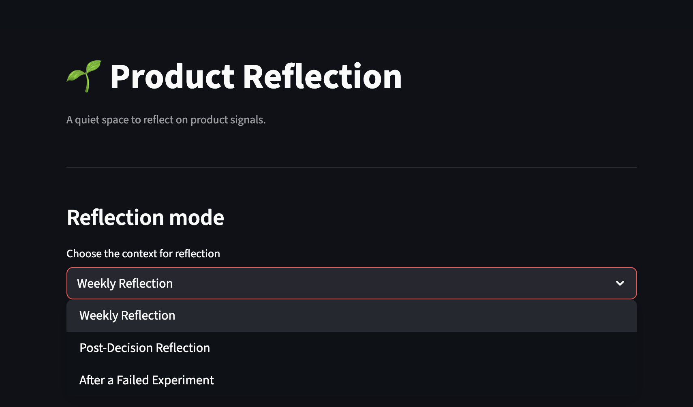
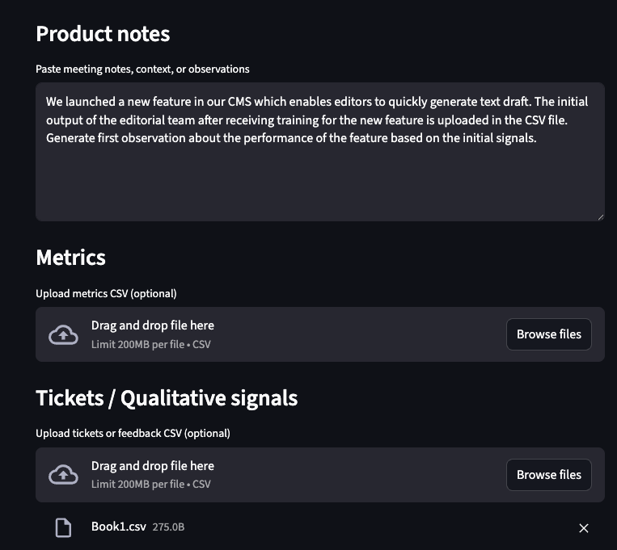
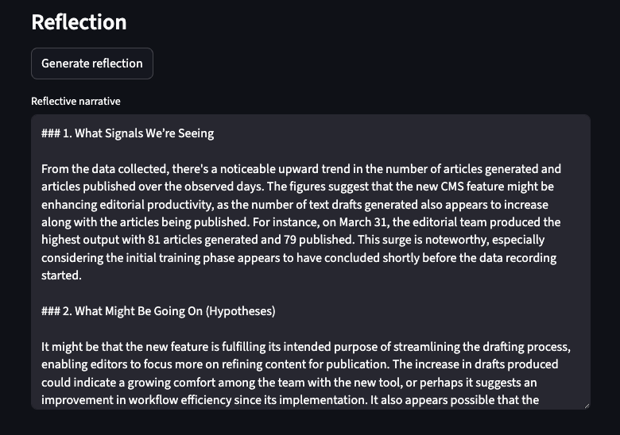

# Product Reflection AI

A reflective AI tool that helps product teams make sense of
messy, incomplete product signals.

## Why this exists
In senior product roles, the hardest part is not access to data,
but making sense of conflicting signals under uncertainty.
This tool explores how AI can support reflection rather than
replace human judgment.

## What it does
- Ingests product notes, metrics, and qualitative signals
- Adapts its reasoning based on reflection context
- Generates calm, hypothesis-driven product narratives

## Reflection modes
- Weekly Reflection
- Post-Decision Reflection
- After a Failed Experiment

## Screenshots

### App overview
Reflection mode selection and calm input surface for product signals.



---

### Adding product signals
Notes, metrics, and qualitative feedback combined into a single reflection context.



---

### Reflective narrative output
A hypothesis‑driven product narrative that surfaces uncertainty and learning.



Each mode constrains the AI differently to reflect real product thinking.

## Design principles
- Narrative over dashboards
- Hypotheses over conclusions
- Transparency over false certainty

## Tech stack
- Python + Streamlit
- OpenAI API (modern SDK)
- Prompt constraints over model tuning

## What I deliberately did not build
- Real-time integrations
- Automated decisions
- Predictive certainty

This is a thinking tool, not an answer engine.

## 🚀 Quick Start

Run the Product Reflection AI locally in a few commands.

```bash
# 1. Clone the repository
git clone https://github.com/<your-username>/product-reflection-ai.git
cd product-reflection-ai

# 2. (Optional) Create and activate a virtual environment
python3 -m venv venv
source venv/bin/activate

# 3. Install dependencies
python3 -m pip install -r requirements.txt

# 4. Set your OpenAI API key
export OPENAI_API_KEY="your-api-key-here"

# 5. Start the app
cd ~/Desktop/product-reflection-ai
python3 -m streamlit run app.py

Open your browser at:
http://localhost:8501

Notes

Streamlit automatically reloads when you change the code — just refresh the browser.
To stop the app, press Ctrl + C in the terminal.
API keys are never committed to this repository.